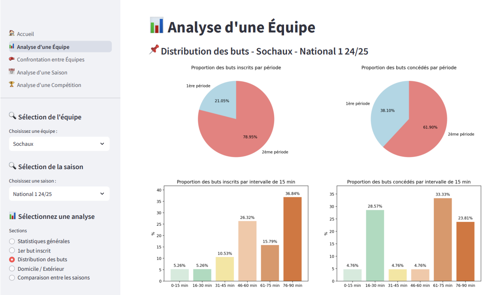
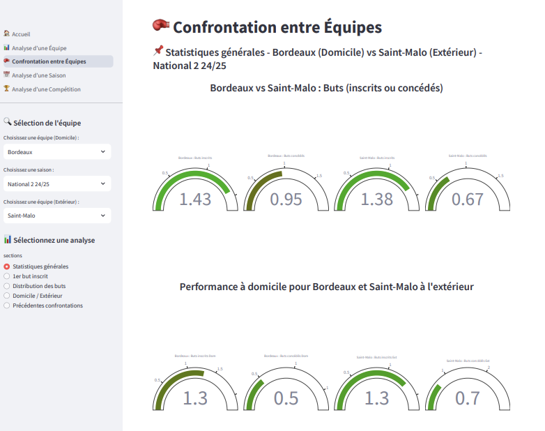
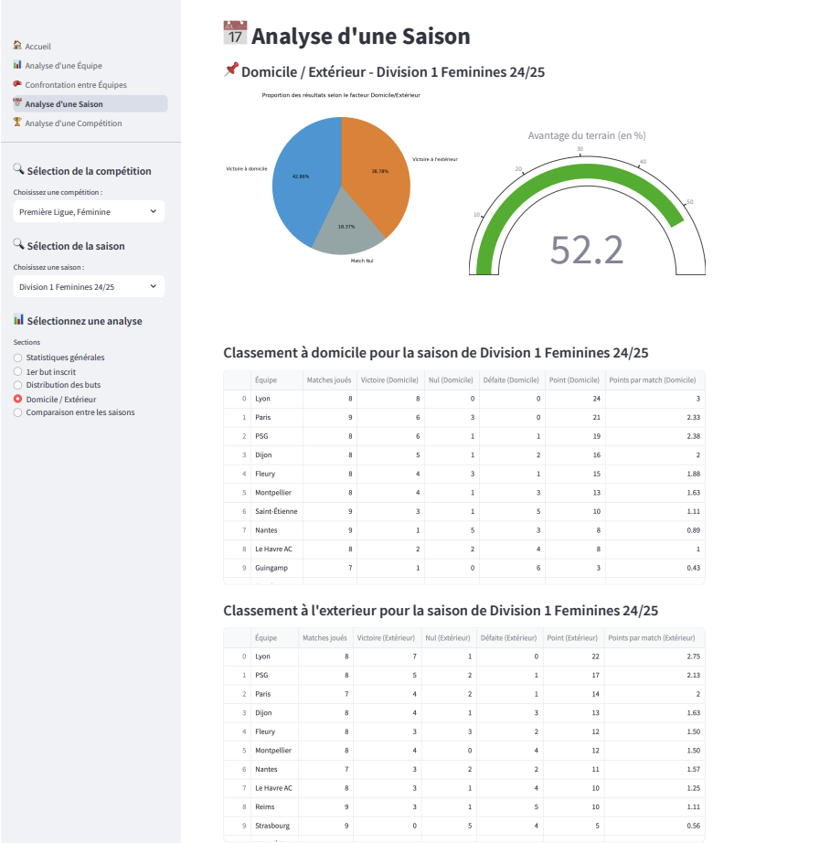
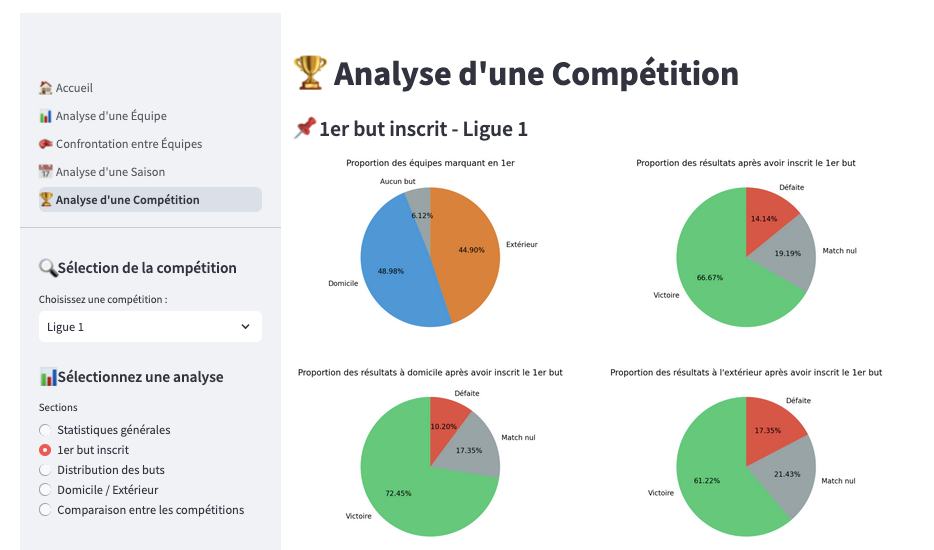

# Projet de data visualisation sur les championnat français

L'objectif de ce projet est de poursuivre le travail effectué lors de mon mémoire de M1 : Analyse comparative de 3 facteurs de performance dans le football : l'impact du 1er but, la distribution temporelle des buts et l’influence de l’avantage du terrain sur le match (domicile/extérieur) entre les équipes de jeunes (U17N et U19N).
Ce mémoire s'articulant uniquement sur seulement 3 compétitions sur la saison 2022/2023, il m'a paru important d'étendre cette analyse en élargissant le nombre de compétitions et de saisons.  
Ainsi, l'analyse prendra en compte les saisons récentes allant de 2021/2022 à 2024/2025 (lorsque cela est possible) et les compétitions suivantes : Ligue 1, Ligue 2, National 1, National 2, Championnat U19N, D1 Féminine et D2 Féminine.

Le projet est disponible sur ce lien : https://datavizfrance-romain-traboul.streamlit.app/

# À faire

Plusieurs fonctionnalités seront disponibles au sein de cette application web : 

- 📊 Analyse d'une Équipe : Analyse du club de votre choix à travers plusieurs statistiques
- 🥊 Confrontation entre Équipes : Analyse comparative entre 2 équipes de votre choix d'une même saison
- 📅 Analyse d'une Saison : Aperçu des tendances sur une saison entière
- 🏆 Analyse d'une Compétition : Comparaison des indicateurs statistiques pour les compétitions de votre choix

  

