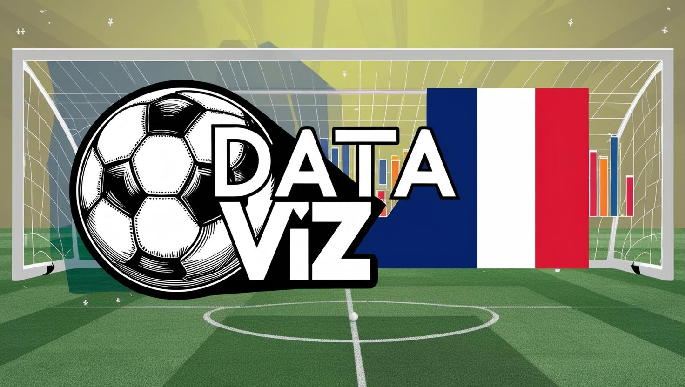
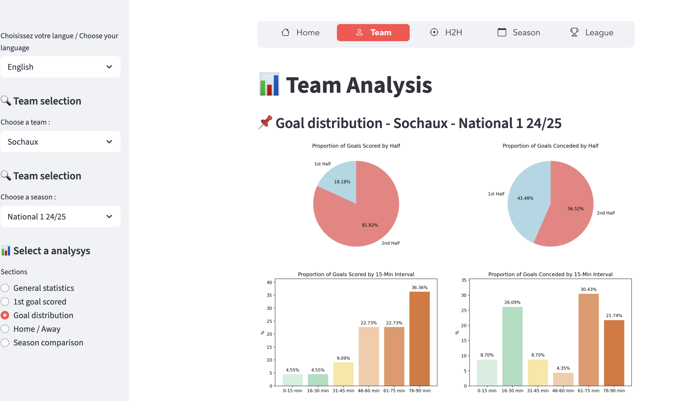
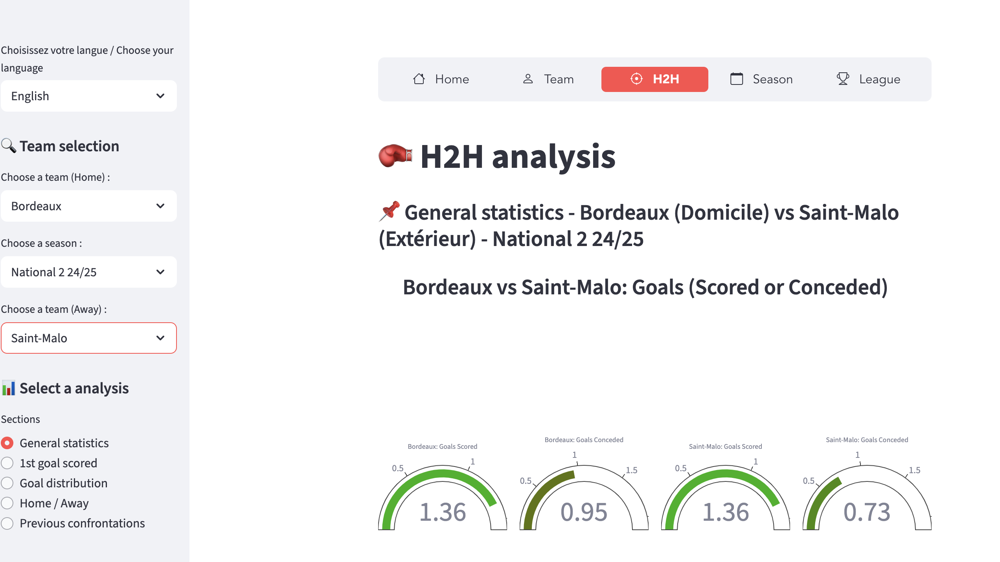
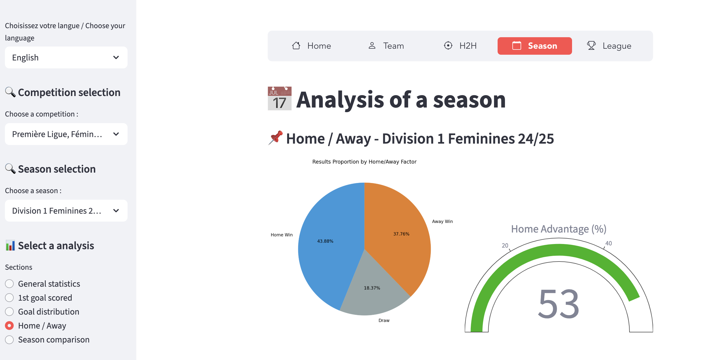
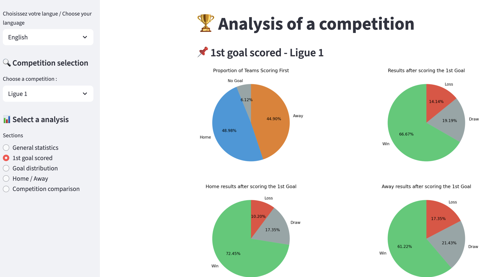

### Français

# Projet de data visualisation sur les championnat français

L'objectif de ce projet est de poursuivre le travail effectué lors de mon mémoire de M1 : Analyse comparative de 3 facteurs de performance dans le football : l'impact du 1er but, la distribution temporelle des buts et l’influence de l’avantage du terrain sur le match (domicile/extérieur) entre les équipes de jeunes (U17N et U19N).
Ce mémoire s'articulant uniquement sur seulement 3 compétitions sur la saison 2022/2023, il m'a paru important d'étendre cette analyse en élargissant le nombre de compétitions et de saisons.  
Ainsi, l'analyse prendra en compte les saisons récentes allant de 2021/2022 à 2024/2025 (lorsque cela est possible) et les compétitions suivantes : Ligue 1, Ligue 2, National 1, National 2, Championnat U19N, D1 Féminine et D2 Féminine.

Le projet est disponible sur ce lien : https://datavizfrance-romain-traboul.streamlit.app/

# À faire

Plusieurs fonctionnalités seront disponibles au sein de cette application web : 

- 📊 Analyse d'une Équipe : Analyse du club de votre choix à travers plusieurs statistiques
- 🥊 Confrontation entre Équipes : Analyse comparative entre 2 équipes de votre choix d'une même saison
- 📅 Analyse d'une Saison : Aperçu des tendances sur une saison entière
- 🏆 Analyse d'une Compétition : Comparaison des indicateurs statistiques pour les compétitions de votre choix

### English

# Data visualization project on the French championships

The objective of this project is to continue the work carried out during my M1 dissertation: Comparative analysis of 3 factors of performance in football: the impact of the 1st goal, the time distribution of goals and the influence of the advantage of the field on the match  (home/away) between youth teams (U17N and U19N).
As this dissertation focuses on only 3 competitions in the 2022/2023 season, it seemed important to me to expand this analysis by expanding the number of competitions and seasons.  
Thus, the analysis will take into account recent seasons ranging from 2021/2022 to 2024/2025 (where possible) and the following competitions: Ligue 1, Ligue 2, National 1, National 2, Championnat U19N, D1 Féminine and D2 Féminine.

The project is available at this link: https://datavizfrance-romain-traboul.streamlit.app/

# To do

Several features will be available within this web application: 

- 📊 Analysis of a team: Analysis of the club of your choice through several statistics
- 🥊 Team Confrontation: Comparative analysis between 2 teams of your choice from the same season
- 📅 Season Analysis: Overview of trends over an entire season
- 🏆 Analysis of a competition: Comparison of statistical indicators for the competitions of your choice
  

